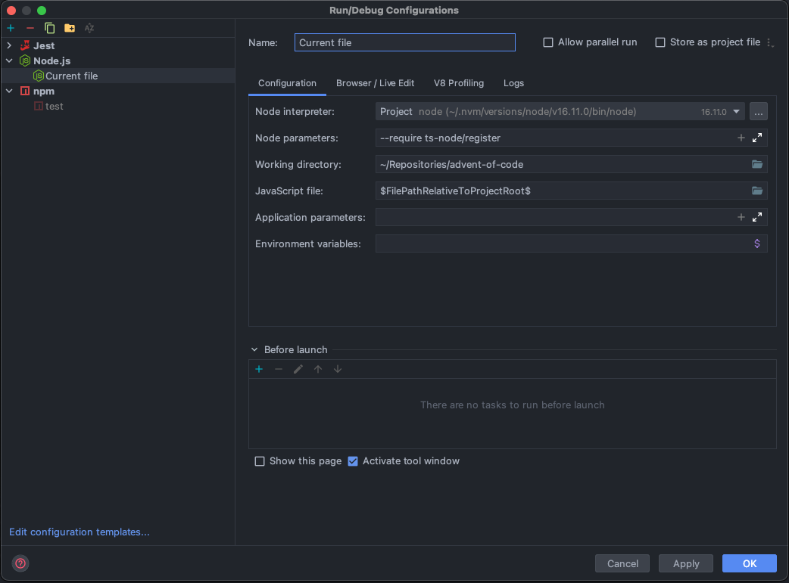

# Advent of Code

My [Advent of Code](https://adventofcode.com) solutions.

## Project setup

If you're looking for a solid project setup I recommend you checkout the stuff built by 
[caderek](https://github.com/caderek). I've reused some of his code, because I wanted to learn how it works, otherwise
I would be using [AoC Runner](https://github.com/caderek/aocrunner) myself :)

## Scripts

Scripts to download the challenges input and copy the template files.

```bash
# Gets input and creates files for current day
npm run today
```

```bash
# Gets input and creates files for selected day
npm run day

✔ Day … 6
✔ Year … 2020
Created directory src/2020/06
No template found, adding empty files
Saved input for AoC 2020 day 6!
```

Usually, I run `npm run today`, go to the `1.ts` file, try to solve the challenge, and hit 
<kbd>ctrl</kbd> + <kbd>R</kbd> to run the current file. Here's my WebStorm config for that:



## Tools

- TypeScript
- Jest
- Prettier
